# Diagrama Entidade-Relacionamento e Modelo Físico da Base de Dados
## Hotel Rainha Njinga

> Modelo relacional derivado da estrutura de dados do website. Desenhado para migração futura para um sistema de base de dados relacional (PostgreSQL / MySQL).

---

## 1. Diagrama Entidade-Relacionamento (DER)

```mermaid
erDiagram

    %% ── ALOJAMENTO ──────────────────────────────────────

    QUARTOS {
        VARCHAR(20) id PK
        VARCHAR(100) nome
        VARCHAR(100) tipo
        TEXT descricao
        VARCHAR(20) preco
        VARCHAR(20) area
        VARCHAR(10) hospedes
        TEXT imagem_principal
        BOOLEAN destaque
        VARCHAR(50) badge
        VARCHAR(10) checkin
        VARCHAR(10) checkout
        TEXT politica_cancelamento
    }

    QUARTO_IMAGENS {
        INT id PK
        VARCHAR(20) quarto_id FK
        TEXT url
        INT ordem
    }

    QUARTO_CARACTERISTICAS {
        INT id PK
        VARCHAR(20) quarto_id FK
        VARCHAR(150) caracteristica
        INT ordem
    }

    QUARTO_COMODIDADES {
        INT id PK
        VARCHAR(20) quarto_id FK
        VARCHAR(20) categoria
        VARCHAR(200) item
        INT ordem
    }

    %% ── GALERIA ─────────────────────────────────────────

    GALERIA_CATEGORIAS {
        VARCHAR(30) chave PK
        VARCHAR(50) nome
        INT ordem
    }

    GALERIA_IMAGENS {
        VARCHAR(20) id PK
        TEXT src
        TEXT miniatura
        VARCHAR(200) texto_alternativo
        VARCHAR(100) legenda
        VARCHAR(30) categoria_chave FK
        BOOLEAN destaque
        INT ordem
    }

    %% ── RESTAURANTE ─────────────────────────────────────

    RESTAURANTE_ITENS {
        VARCHAR(20) id PK
        VARCHAR(100) nome
        TEXT descricao
        VARCHAR(20) preco
        VARCHAR(15) tipo
        BOOLEAN destaque
        INT ordem
    }

    RESTAURANTE_ITEM_BADGES {
        INT id PK
        VARCHAR(20) item_id FK
        VARCHAR(50) badge
    }

    RESTAURANTE_HORARIOS {
        INT id PK
        VARCHAR(60) refeicao
        VARCHAR(30) horario
        VARCHAR(60) dias
        INT ordem
    }

    RESTAURANTE_DESTAQUES {
        INT id PK
        VARCHAR(80) etiqueta
        VARCHAR(80) valor
        INT ordem
    }

    %% ── EVENTOS ─────────────────────────────────────────

    EVENTOS_ESPACOS {
        VARCHAR(30) id PK
        VARCHAR(100) nome
        TEXT descricao
        VARCHAR(20) area
        TEXT imagem
        VARCHAR(60) badge
        INT cap_teatro
        INT cap_banquete
        INT cap_cocktail
        INT cap_escola
    }

    EVENTOS_ESPACO_CARACTERISTICAS {
        INT id PK
        VARCHAR(30) espaco_id FK
        VARCHAR(150) caracteristica
        INT ordem
    }

    EVENTOS_TIPOS {
        VARCHAR(30) id PK
        VARCHAR(30) icone
        VARCHAR(100) nome
        TEXT descricao
    }

    EVENTOS_TIPO_ITENS {
        INT id PK
        VARCHAR(30) tipo_id FK
        VARCHAR(200) item
        INT ordem
    }

    EVENTOS_PACOTES {
        VARCHAR(30) id PK
        VARCHAR(100) nome
        VARCHAR(20) preco
        VARCHAR(50) unidade
        TEXT descricao
        BOOLEAN destaque
        VARCHAR(60) badge
    }

    EVENTOS_PACOTE_ITENS {
        INT id PK
        VARCHAR(30) pacote_id FK
        VARCHAR(200) item
        INT ordem
    }

    EVENTOS_EQUIPAMENTO {
        INT id PK
        VARCHAR(100) nome
        TEXT descricao
    }

    %% ── SERVIÇOS ─────────────────────────────────────────

    SERVICOS_CATEGORIAS {
        VARCHAR(30) id PK
        VARCHAR(100) nome
        TEXT descricao
        TEXT imagem
        INT ordem
    }

    SERVICOS {
        VARCHAR(50) id PK
        VARCHAR(30) categoria_id FK
        VARCHAR(30) icone
        VARCHAR(100) nome
        TEXT descricao
        VARCHAR(100) url_link
        VARCHAR(80) texto_link
        INT ordem
    }

    SERVICO_DETALHES {
        INT id PK
        VARCHAR(50) servico_id FK
        TEXT detalhe
        INT ordem
    }

    %% ── INSTITUCIONAL ────────────────────────────────────

    INSTITUCIONAL {
        INT id PK
        TEXT missao
        TEXT visao
    }

    INSTITUCIONAL_ESTATISTICAS {
        INT id PK
        VARCHAR(20) valor
        VARCHAR(60) etiqueta
        INT ordem
    }

    INSTITUCIONAL_VALORES {
        INT id PK
        VARCHAR(30) icone
        VARCHAR(100) titulo
        TEXT descricao
        INT ordem
    }

    INSTITUCIONAL_MARCOS {
        INT id PK
        VARCHAR(4) ano
        VARCHAR(100) titulo
        TEXT descricao
        INT ordem
    }

    EQUIPA {
        INT id PK
        VARCHAR(100) nome
        VARCHAR(100) cargo
        TEXT biografia
        TEXT fotografia
        INT ordem
    }

    %% ── HOMEPAGE ─────────────────────────────────────────

    HOMEPAGE_SLIDES {
        INT id PK
        TEXT url_imagem
        VARCHAR(200) texto_alternativo
        INT ordem
    }

    HOMEPAGE_STATS {
        INT id PK
        VARCHAR(20) valor
        VARCHAR(60) etiqueta
        INT ordem
    }

    HOMEPAGE_CARTOES {
        INT id PK
        VARCHAR(30) icone
        VARCHAR(100) titulo
        TEXT descricao
        INT ordem
    }

    %% ── RELACIONAMENTOS ──────────────────────────────────

    QUARTOS                        ||--|{  QUARTO_IMAGENS                    : "tem imagens"
    QUARTOS                        ||--|{  QUARTO_CARACTERISTICAS             : "tem características"
    QUARTOS                        ||--|{  QUARTO_COMODIDADES                 : "tem comodidades"
    GALERIA_CATEGORIAS             ||--|{  GALERIA_IMAGENS                    : "classifica"
    RESTAURANTE_ITENS              ||--|{  RESTAURANTE_ITEM_BADGES            : "tem badges"
    EVENTOS_ESPACOS                ||--|{  EVENTOS_ESPACO_CARACTERISTICAS     : "tem características"
    EVENTOS_TIPOS                  ||--|{  EVENTOS_TIPO_ITENS                 : "inclui itens"
    EVENTOS_PACOTES                ||--|{  EVENTOS_PACOTE_ITENS               : "inclui itens"
    SERVICOS_CATEGORIAS            ||--|{  SERVICOS                           : "agrupa"
    SERVICOS                       ||--|{  SERVICO_DETALHES                   : "tem detalhes"
```



---

## 2. Modelo Físico da Base de Dados (DDL — PostgreSQL)

### 2.1 Alojamento

```sql
-- ─────────────────────────────────────────────────────────────────────────────
-- QUARTOS
-- ─────────────────────────────────────────────────────────────────────────────

CREATE TABLE quartos (
    id                   VARCHAR(20)  PRIMARY KEY,
    nome                 VARCHAR(100) NOT NULL,
    tipo                 VARCHAR(100) NOT NULL,
    descricao            TEXT         NOT NULL,
    preco                VARCHAR(20)  NOT NULL,
    area                 VARCHAR(20),
    hospedes             VARCHAR(10),
    imagem_principal     TEXT,
    destaque             BOOLEAN      NOT NULL DEFAULT FALSE,
    badge                VARCHAR(50),
    checkin              VARCHAR(10)  DEFAULT '12:00',
    checkout             VARCHAR(10)  DEFAULT '12:00',
    politica_cancelamento TEXT
);

CREATE TABLE quarto_imagens (
    id          SERIAL       PRIMARY KEY,
    quarto_id   VARCHAR(20)  NOT NULL REFERENCES quartos(id) ON DELETE CASCADE,
    url         TEXT         NOT NULL,
    ordem       INT          NOT NULL DEFAULT 0
);

CREATE TABLE quarto_caracteristicas (
    id            SERIAL       PRIMARY KEY,
    quarto_id     VARCHAR(20)  NOT NULL REFERENCES quartos(id) ON DELETE CASCADE,
    caracteristica VARCHAR(150) NOT NULL,
    ordem          INT          NOT NULL DEFAULT 0
);

CREATE TABLE quarto_comodidades (
    id          SERIAL       PRIMARY KEY,
    quarto_id   VARCHAR(20)  NOT NULL REFERENCES quartos(id) ON DELETE CASCADE,
    categoria   VARCHAR(20)  NOT NULL
                             CHECK (categoria IN ('quarto', 'banheiro', 'tecnologia', 'servicos')),
    item        VARCHAR(200) NOT NULL,
    ordem       INT          NOT NULL DEFAULT 0
);

CREATE INDEX idx_quarto_imagens_quarto     ON quarto_imagens(quarto_id);
CREATE INDEX idx_quarto_caract_quarto      ON quarto_caracteristicas(quarto_id);
CREATE INDEX idx_quarto_comodidades_quarto ON quarto_comodidades(quarto_id);
CREATE INDEX idx_quarto_comodidades_cat    ON quarto_comodidades(quarto_id, categoria);
```

### 2.2 Galeria

```sql
-- ─────────────────────────────────────────────────────────────────────────────
-- GALERIA
-- ─────────────────────────────────────────────────────────────────────────────

CREATE TABLE galeria_categorias (
    chave   VARCHAR(30) PRIMARY KEY,
    nome    VARCHAR(50) NOT NULL,
    ordem   INT         NOT NULL DEFAULT 0
);

CREATE TABLE galeria_imagens (
    id                  VARCHAR(20)  PRIMARY KEY,
    src                 TEXT         NOT NULL,
    miniatura           TEXT,
    texto_alternativo   VARCHAR(200) NOT NULL,
    legenda             VARCHAR(100),
    categoria_chave     VARCHAR(30)  NOT NULL REFERENCES galeria_categorias(chave),
    destaque            BOOLEAN      NOT NULL DEFAULT FALSE,
    ordem               INT          NOT NULL DEFAULT 0
);

CREATE INDEX idx_galeria_imagens_categoria ON galeria_imagens(categoria_chave);
CREATE INDEX idx_galeria_imagens_destaque  ON galeria_imagens(destaque);
```

### 2.3 Restaurante

```sql
-- ─────────────────────────────────────────────────────────────────────────────
-- RESTAURANTE
-- ─────────────────────────────────────────────────────────────────────────────

CREATE TABLE restaurante_itens (
    id          VARCHAR(20)  PRIMARY KEY,
    nome        VARCHAR(100) NOT NULL,
    descricao   TEXT         NOT NULL,
    preco       VARCHAR(20)  NOT NULL,
    tipo        VARCHAR(15)  NOT NULL
                             CHECK (tipo IN ('entradas', 'principais', 'sobremesas', 'cocktails')),
    destaque    BOOLEAN      NOT NULL DEFAULT FALSE,
    ordem       INT          NOT NULL DEFAULT 0
);

CREATE TABLE restaurante_item_badges (
    id       SERIAL      PRIMARY KEY,
    item_id  VARCHAR(20) NOT NULL REFERENCES restaurante_itens(id) ON DELETE CASCADE,
    badge    VARCHAR(50) NOT NULL
                         CHECK (badge IN ('Tradicional','Vegetariano','Sem Glúten',
                                          'Premium','Assinatura','Sem Álcool'))
);

CREATE TABLE restaurante_horarios (
    id        SERIAL       PRIMARY KEY,
    refeicao  VARCHAR(60)  NOT NULL,
    horario   VARCHAR(30)  NOT NULL,
    dias      VARCHAR(60)  NOT NULL,
    ordem     INT          NOT NULL DEFAULT 0
);

CREATE TABLE restaurante_destaques (
    id        SERIAL       PRIMARY KEY,
    etiqueta  VARCHAR(80)  NOT NULL,
    valor     VARCHAR(80)  NOT NULL,
    ordem     INT          NOT NULL DEFAULT 0
);

CREATE INDEX idx_rest_itens_tipo     ON restaurante_itens(tipo);
CREATE INDEX idx_rest_itens_destaque ON restaurante_itens(destaque);
CREATE INDEX idx_rest_badges_item    ON restaurante_item_badges(item_id);
```

### 2.4 Eventos

```sql
-- ─────────────────────────────────────────────────────────────────────────────
-- EVENTOS
-- ─────────────────────────────────────────────────────────────────────────────

CREATE TABLE eventos_espacos (
    id             VARCHAR(30)  PRIMARY KEY,
    nome           VARCHAR(100) NOT NULL,
    descricao      TEXT         NOT NULL,
    area           VARCHAR(20),
    imagem         TEXT,
    badge          VARCHAR(60),
    cap_teatro     INT,
    cap_banquete   INT,
    cap_cocktail   INT,
    cap_escola     INT
);

CREATE TABLE eventos_espaco_caracteristicas (
    id           SERIAL       PRIMARY KEY,
    espaco_id    VARCHAR(30)  NOT NULL REFERENCES eventos_espacos(id) ON DELETE CASCADE,
    caracteristica VARCHAR(150) NOT NULL,
    ordem        INT          NOT NULL DEFAULT 0
);

CREATE TABLE eventos_tipos (
    id         VARCHAR(30)  PRIMARY KEY,
    icone      VARCHAR(30)  NOT NULL,
    nome       VARCHAR(100) NOT NULL,
    descricao  TEXT         NOT NULL
);

CREATE TABLE eventos_tipo_itens (
    id        SERIAL       PRIMARY KEY,
    tipo_id   VARCHAR(30)  NOT NULL REFERENCES eventos_tipos(id) ON DELETE CASCADE,
    item      VARCHAR(200) NOT NULL,
    ordem     INT          NOT NULL DEFAULT 0
);

CREATE TABLE eventos_pacotes (
    id         VARCHAR(30)  PRIMARY KEY,
    nome       VARCHAR(100) NOT NULL,
    preco      VARCHAR(20)  NOT NULL,
    unidade    VARCHAR(50)  NOT NULL,
    descricao  TEXT         NOT NULL,
    destaque   BOOLEAN      NOT NULL DEFAULT FALSE,
    badge      VARCHAR(60)
);

CREATE TABLE eventos_pacote_itens (
    id         SERIAL       PRIMARY KEY,
    pacote_id  VARCHAR(30)  NOT NULL REFERENCES eventos_pacotes(id) ON DELETE CASCADE,
    item       VARCHAR(200) NOT NULL,
    ordem      INT          NOT NULL DEFAULT 0
);

CREATE TABLE eventos_equipamento (
    id         SERIAL       PRIMARY KEY,
    nome       VARCHAR(100) NOT NULL,
    descricao  TEXT         NOT NULL
);

CREATE INDEX idx_ev_espaco_caract  ON eventos_espaco_caracteristicas(espaco_id);
CREATE INDEX idx_ev_tipo_itens     ON eventos_tipo_itens(tipo_id);
CREATE INDEX idx_ev_pacote_itens   ON eventos_pacote_itens(pacote_id);
```

### 2.5 Serviços

```sql
-- ─────────────────────────────────────────────────────────────────────────────
-- SERVIÇOS
-- ─────────────────────────────────────────────────────────────────────────────

CREATE TABLE servicos_categorias (
    id         VARCHAR(30)  PRIMARY KEY,
    nome       VARCHAR(100) NOT NULL,
    descricao  TEXT         NOT NULL,
    imagem     TEXT,
    ordem      INT          NOT NULL DEFAULT 0
);

CREATE TABLE servicos (
    id           VARCHAR(50)  PRIMARY KEY,
    categoria_id VARCHAR(30)  NOT NULL REFERENCES servicos_categorias(id) ON DELETE CASCADE,
    icone        VARCHAR(30)  NOT NULL,
    nome         VARCHAR(100) NOT NULL,
    descricao    TEXT         NOT NULL,
    url_link     VARCHAR(100),
    texto_link   VARCHAR(80),
    ordem        INT          NOT NULL DEFAULT 0
);

CREATE TABLE servico_detalhes (
    id          SERIAL       PRIMARY KEY,
    servico_id  VARCHAR(50)  NOT NULL REFERENCES servicos(id) ON DELETE CASCADE,
    detalhe     TEXT         NOT NULL,
    ordem       INT          NOT NULL DEFAULT 0
);

CREATE INDEX idx_servicos_categoria ON servicos(categoria_id);
CREATE INDEX idx_servico_detalhes   ON servico_detalhes(servico_id);
```

### 2.6 Institucional

```sql
-- ─────────────────────────────────────────────────────────────────────────────
-- INSTITUCIONAL (tabela singleton — sempre 1 registo com id = 1)
-- ─────────────────────────────────────────────────────────────────────────────

CREATE TABLE institucional (
    id      INT  PRIMARY KEY DEFAULT 1,
    missao  TEXT NOT NULL,
    visao   TEXT NOT NULL,
    CONSTRAINT single_row CHECK (id = 1)
);

CREATE TABLE institucional_estatisticas (
    id       SERIAL       PRIMARY KEY,
    valor    VARCHAR(20)  NOT NULL,
    etiqueta VARCHAR(60)  NOT NULL,
    ordem    INT          NOT NULL DEFAULT 0
);

CREATE TABLE institucional_valores (
    id         SERIAL       PRIMARY KEY,
    icone      VARCHAR(30)  NOT NULL,
    titulo     VARCHAR(100) NOT NULL,
    descricao  TEXT         NOT NULL,
    ordem      INT          NOT NULL DEFAULT 0
);

CREATE TABLE institucional_marcos (
    id         SERIAL       PRIMARY KEY,
    ano        CHAR(4)      NOT NULL,
    titulo     VARCHAR(100) NOT NULL,
    descricao  TEXT         NOT NULL,
    ordem      INT          NOT NULL DEFAULT 0
);

CREATE TABLE equipa (
    id          SERIAL       PRIMARY KEY,
    nome        VARCHAR(100) NOT NULL,
    cargo       VARCHAR(100) NOT NULL,
    biografia   TEXT         NOT NULL,
    fotografia  TEXT,
    ordem       INT          NOT NULL DEFAULT 0
);
```

### 2.7 Homepage

```sql
-- ─────────────────────────────────────────────────────────────────────────────
-- HOMEPAGE
-- ─────────────────────────────────────────────────────────────────────────────

CREATE TABLE homepage_slides (
    id                  SERIAL       PRIMARY KEY,
    url_imagem          TEXT         NOT NULL,
    texto_alternativo   VARCHAR(200) NOT NULL,
    ordem               INT          NOT NULL DEFAULT 0
);

CREATE TABLE homepage_stats (
    id       SERIAL       PRIMARY KEY,
    valor    VARCHAR(20)  NOT NULL,
    etiqueta VARCHAR(60)  NOT NULL,
    ordem    INT          NOT NULL DEFAULT 0
);

CREATE TABLE homepage_cartoes (
    id         SERIAL       PRIMARY KEY,
    icone      VARCHAR(30)  NOT NULL,
    titulo     VARCHAR(100) NOT NULL,
    descricao  TEXT         NOT NULL,
    ordem      INT          NOT NULL DEFAULT 0
);
```

---

## 3. Resumo das tabelas

| Domínio | Tabelas | Descrição |
|---------|---------|-----------|
| **Alojamento** | `quartos`, `quarto_imagens`, `quarto_caracteristicas`, `quarto_comodidades` | Quartos, galeria por quarto e comodidades detalhadas |
| **Galeria** | `galeria_categorias`, `galeria_imagens` | Fotografias do hotel com categorias e filtros |
| **Restaurante** | `restaurante_itens`, `restaurante_item_badges`, `restaurante_horarios`, `restaurante_destaques` | Menu completo, classificações e horários |
| **Eventos** | `eventos_espacos`, `eventos_espaco_caracteristicas`, `eventos_tipos`, `eventos_tipo_itens`, `eventos_pacotes`, `eventos_pacote_itens`, `eventos_equipamento` | Salas, tipos de evento, pacotes e equipamento |
| **Serviços** | `servicos_categorias`, `servicos`, `servico_detalhes` | Catálogo de serviços por categoria |
| **Institucional** | `institucional`, `institucional_estatisticas`, `institucional_valores`, `institucional_marcos`, `equipa` | Missão, visão, valores, cronologia e equipa |
| **Homepage** | `homepage_slides`, `homepage_stats`, `homepage_cartoes` | Conteúdo da página inicial |

**Total: 22 tabelas**

---

## 4. Convenções adoptadas

| Convenção | Descrição |
|-----------|-----------|
| **Chaves primárias** | `VARCHAR` quando o ID vem do JSON (ex: `suite`, `p1`); `SERIAL` quando gerado automaticamente |
| **Chaves estrangeiras** | `ON DELETE CASCADE` para tabelas filhas (listas/itens) |
| **Campo `ordem`** | Presente em todas as listas para preservar a sequência de apresentação |
| **Enumerações** | Implementadas como `CHECK` constraints em vez de tipo `ENUM` para maior portabilidade |
| **Tabela singleton** | `institucional` usa `CHECK (id = 1)` para garantir um único registo |
| **Índices** | Criados em todas as colunas de chave estrangeira e colunas de filtragem frequente |
| **Nomes** | Snake_case, em português, sem acentos nas colunas |
