```mermaid
classDiagram
    direction TB

    %% ─────────────────────────────────────────
    %% DOMÍNIO: ALOJAMENTO
    %% ─────────────────────────────────────────

    class Quarto {
        +String id
        +String nome
        +String tipo
        +String descricao
        +String preco
        +String area
        +String hospedes
        +String imagemPrincipal
        +List~String~ imagens
        +List~String~ caracteristicas
        +Boolean destaque
        +String badge
        +String checkin
        +String checkout
        +String politicaCancelamento
        +Comodidades comodidades
    }

    class Comodidades {
        +List~String~ quarto
        +List~String~ casaDeBanho
        +List~String~ tecnologia
        +List~String~ servicosIncluidos
    }

    Quarto "1" *-- "1" Comodidades : contém

    %% ─────────────────────────────────────────
    %% DOMÍNIO: GALERIA
    %% ─────────────────────────────────────────

    class ImagemGaleria {
        +String id
        +String srcAltaResolucao
        +String miniatura
        +String textoAlternativo
        +String legenda
        +Boolean destaque
        +Int ordem
    }

    class CategoriaGaleria {
        +String chave
        +String nome
        +Int ordem
    }

    ImagemGaleria "*" --> "1" CategoriaGaleria : pertence a

    %% ─────────────────────────────────────────
    %% DOMÍNIO: RESTAURANTE
    %% ─────────────────────────────────────────

    class Restaurante {
        +Menu menu
        +List~HorarioFuncionamento~ horarios
        +List~DestaqueEspaco~ destaques
    }

    class Menu {
        +List~ItemMenu~ entradas
        +List~ItemMenu~ pratos_principais
        +List~ItemMenu~ sobremesas
        +List~ItemMenu~ cocktails
    }

    class ItemMenu {
        +String id
        +String nome
        +String descricao
        +String preco
        +TipoItemMenu tipo
        +Boolean destaque
        +List~String~ badges
    }

    class HorarioFuncionamento {
        +String refeicao
        +String horario
        +String dias
    }

    class DestaqueEspaco {
        +String etiqueta
        +String valor
    }

    class TipoItemMenu {
        <<enumeration>>
        ENTRADA
        PRINCIPAL
        SOBREMESA
        COCKTAIL
    }

    Restaurante "1" *-- "1" Menu : tem
    Restaurante "1" *-- "1..*" HorarioFuncionamento : opera em
    Restaurante "1" *-- "0..*" DestaqueEspaco : apresenta
    Menu "1" *-- "1..*" ItemMenu : contém
    ItemMenu --> TipoItemMenu : é do tipo

    %% ─────────────────────────────────────────
    %% DOMÍNIO: EVENTOS
    %% ─────────────────────────────────────────

    class EspacoEvento {
        +String id
        +String nome
        +String descricao
        +String area
        +String imagem
        +String badge
        +Capacidade capacidade
        +List~String~ caracteristicas
    }

    class Capacidade {
        +Int teatro
        +Int banquete
        +Int cocktail
        +Int escola
    }

    class TipoEvento {
        +String id
        +String icone
        +String nome
        +String descricao
        +List~String~ itensIncluidos
    }

    class PacoteEvento {
        +String id
        +String nome
        +String preco
        +String unidade
        +String descricao
        +Boolean destaque
        +String badge
        +List~String~ itensIncluidos
    }

    class Equipamento {
        +String nome
        +String descricao
    }

    EspacoEvento "1" *-- "1" Capacidade : tem
    EspacoEvento "1" --> "0..*" TipoEvento : acomoda
    EspacoEvento "0..*" --> "0..*" Equipamento : disponibiliza

    %% ─────────────────────────────────────────
    %% DOMÍNIO: SERVIÇOS
    %% ─────────────────────────────────────────

    class CategoriaServico {
        +String id
        +String nome
        +String descricao
        +String imagem
    }

    class Servico {
        +String id
        +String icone
        +String nome
        +String descricao
        +String urlLink
        +String textoLink
        +List~String~ detalhes
    }

    CategoriaServico "1" *-- "1..*" Servico : agrupa

    %% ─────────────────────────────────────────
    %% DOMÍNIO: INSTITUCIONAL
    %% ─────────────────────────────────────────

    class Hotel {
        +String missao
        +String visao
        +List~Estatistica~ estatisticas
        +List~ValorEmpresa~ valores
        +List~Marco~ cronologia
        +List~MembroEquipa~ equipa
    }

    class MembroEquipa {
        +String nome
        +String cargo
        +String biografia
        +String fotografia
    }

    class Marco {
        +String ano
        +String titulo
        +String descricao
    }

    class ValorEmpresa {
        +String icone
        +String titulo
        +String descricao
    }

    class Estatistica {
        +String valor
        +String etiqueta
    }

    Hotel "1" *-- "1..*" MembroEquipa : tem
    Hotel "1" *-- "1..*" Marco : registou
    Hotel "1" *-- "1..*" ValorEmpresa : rege-se por
    Hotel "1" *-- "1..*" Estatistica : apresenta

    %% ─────────────────────────────────────────
    %% DOMÍNIO: HOMEPAGE
    %% ─────────────────────────────────────────

    class PaginaInicial {
        +Hero hero
        +SeccaoSobre sobre
    }

    class Hero {
        +List~SlideHero~ slides
        +List~Estatistica~ estatisticas
    }

    class SlideHero {
        +String urlImagem
        +String textoAlternativo
        +Int ordem
    }

    class SeccaoSobre {
        +List~CartaoDestaque~ cartoes
    }

    class CartaoDestaque {
        +String icone
        +String titulo
        +String descricao
    }

    PaginaInicial "1" *-- "1" Hero : apresenta
    PaginaInicial "1" *-- "1" SeccaoSobre : exibe
    Hero "1" *-- "2..*" SlideHero : contém
    Hero "1" *-- "1..*" Estatistica : mostra
    SeccaoSobre "1" *-- "3" CartaoDestaque : tem

    %% ─────────────────────────────────────────
    %% AGREGADOR: HOTEL (relações de alto nível)
    %% ─────────────────────────────────────────

    Hotel "1" --> "1..*" Quarto : oferece
    Hotel "1" --> "1" Restaurante : opera
    Hotel "1" --> "1..*" EspacoEvento : possui
    Hotel "1" --> "1..*" CategoriaServico : presta
    Hotel "1" --> "1" PaginaInicial : apresenta no website
    Hotel "1" --> "1..*" ImagemGaleria : exibe
```

# Diagrama de Classes — Hotel Rainha Njinga

> Representação do modelo de domínio orientado a objectos do sistema de gestão de conteúdo do website do Hotel Rainha Njinga.

---

---

## Legenda

| Notação | Significado |
|---------|-------------|
| `*--` | Composição (o filho não existe sem o pai) |
| `-->` | Associação / Dependência |
| `"1"` | Exactamente um |
| `"1..*"` | Um ou mais |
| `"0..*"` | Zero ou mais |
| `<<enumeration>>` | Tipo enumerado |
| `+` | Membro público |
| `List~T~` | Lista de elementos do tipo T |

---

## Descrição dos domínios

| Domínio | Classes | Responsabilidade |
|---------|---------|-----------------|
| **Alojamento** | Quarto, Comodidades | Gestão dos tipos de quarto, preços e comodidades |
| **Galeria** | ImagemGaleria, CategoriaGaleria | Gestão das fotografias e categorias do website |
| **Restaurante** | Restaurante, Menu, ItemMenu, HorarioFuncionamento | Gestão do menu, preços e horários |
| **Eventos** | EspacoEvento, Capacidade, TipoEvento, PacoteEvento | Gestão de espaços, pacotes e tipos de evento |
| **Serviços** | CategoriaServico, Servico | Catálogo de serviços do hotel |
| **Institucional** | Hotel, MembroEquipa, Marco, ValorEmpresa | Informação institucional e equipa |
| **Homepage** | PaginaInicial, Hero, SlideHero, CartaoDestaque | Conteúdo da página principal do website |
